# Use Case 2 - Ingest data from a Postgres database (CDC)

In this lab you'll replicate live data out of a PostgreSQL database into your own
Snowflake database using the **Openflow Connector for PostgreSQL** and Change
Data Capture (CDC).

Unlike UC1, you don't build a flow processor-by-processor. A connector is a
pre-packaged flow: you supply configuration, start it, and it handles the
initial snapshot plus a continuous stream of inserts, updates and deletes.

A background job on the source inserts **5 new rows every 5 seconds**, so once
your connector is running you see a genuinely live stream - not a one-off load.

Everything shared has already been set up for you: your own database, your own
role, your own Openflow runtime, the Postgres source, and the credentials.

You should have received:
- **Username**: `SWTBER26_USER<N>` (e.g. `SWTBER26_USER07`)
- **Password** (keep it - you won't be asked to change it)

Everywhere below, replace `<N>` with your own attendee number.

---

## What you're building

```
PostgreSQL (shared, Snowflake Postgres)          Snowflake
+-------------------------------------+          +----------------------------+
|  public.sensors          (10 rows)  |          | SWTBER26_USER<N>           |
|  public.sensor_readings  (~20k +    |  CDC     |   PUBLIC.SENSORS           |
|    5 new rows every 5 seconds)      | ------>  |   PUBLIC.SENSOR_READINGS   |
+-------------------------------------+          +----------------------------+
         ^                                                    ^
         | one shared publication                             | your own
         | swtber26_cdc_pub                                   | Openflow runtime
```

Every attendee replicates the **same** source tables into their **own**
Snowflake database. Each connector gets its own PostgreSQL replication slot, so
you're fully independent of everybody else in the room.

---

## Step 1 - Log in and confirm your role

1. Go to Snowsight and log in with your assigned username/password.
2. Check the role selector (top left) - it should already default to
   `SWTBER26_USER<N>_RL`. This is your role for everything in this lab: it owns
   your database and is your Openflow runtime's "execute-as" role.

## Step 2 - Find your runtime

Your runtime (`SWTBER26_USER<N>_RUNTIME`) has been pre-created and is already
**Active** - runtime provisioning takes 3-5 minutes, so it was done ahead of
time.

1. In the left navigation, go to **Ingestion » Openflow**.
2. You should see `SWTBER26_USER<N>_RUNTIME`. You own it - nobody else can see
   or modify it.

Or via SQL:

```sql
SHOW OPENFLOW RUNTIMES IN DATABASE SWTBER26_USER<N>;
```

> For reference, this is how it was created - you can make more yourself after
> the lab:
>
> ```sql
> CREATE OPENFLOW RUNTIME SWTBER26_USER<N>.PUBLIC.SWTBER26_USER<N>_RUNTIME
>   IN DEPLOYMENT MY_SNOWFLAKE_DEPLOYMENT
>   NODE_TYPE = SMALL
>   MIN_NODES = 1          -- the Postgres CDC connector requires exactly 1 node
>   MAX_NODES = 1
>   EXECUTE_AS_ROLE = SWTBER26_USER<N>_RL
>   EXTERNAL_ACCESS_INTEGRATIONS = (SWTBER26_LAB_EAI);
> ```

## Step 3 - Get the connection details

The Postgres host, user, publication and the name of the password secret are
available to you as a view. The password itself is held in a Snowflake secret -
you never see its value, you just point the connector at it.

```sql
USE ROLE SWTBER26_USER<N>_RL;
SELECT * FROM OPENFLOW_SHARED.PG.UC2_CONNECTION_INFO;
```

You'll get:

| Field | Value |
|---|---|
| `PG_HOST` | the Snowflake Postgres hostname |
| `PG_PORT` | `5432` |
| `PG_DATABASE` | `postgres` |
| `PG_USER` | `swtber26_cdc` |
| `PG_PUBLICATION` | `swtber26_cdc_pub` |
| `PG_TABLES` | `public.sensors,public.sensor_readings` |
| `PG_PASSWORD_SECRET` | `OPENFLOW_SHARED.PG.SWTBER26_PG_CDC_SECRET` |
| `JDBC_URL` | the full `jdbc:postgresql://...` URL |

Everything you need for this lab lives in the shared `OPENFLOW_SHARED` database,
and your role can already read all of it - you don't need to create or request
anything:

| What | Where |
|---|---|
| Connection details (no password) | `OPENFLOW_SHARED.PG.UC2_CONNECTION_INFO` (view) |
| Postgres password | `OPENFLOW_SHARED.PG.SWTBER26_PG_CDC_SECRET` (secret - referenced, never read by you) |
| JDBC driver + config template | `OPENFLOW_SHARED.PG.UC2_FILES` (stage) |
| Ready-made connector config | `OPENFLOW_SHARED.PG.UC2_CONFIG_FOR('<your_db>')` (function) |
| Runtime and connector logs | `OPENFLOW_SHARED.INFRA.OPENFLOW_EVENTS` (event table) |

Access comes from the shared technical role `SWTBER26_ATTENDEE_RL`, which your
own role inherits. Every attendee has exactly the same access.

---

## Step 4 - Install and configure the connector

Choose **one** of the two paths below. Option A (guided setup) is the
recommended route for the lab. Option B (SQL) is the same thing done
declaratively, and is how you'd automate this in the real world.

### Option A - Guided setup in Snowsight

#### 4.0 - First, download the JDBC driver

The connector does **not** ship with the PostgreSQL driver - you supply it as a
file. A copy is staged for you, and you can download it entirely in the browser:
in Snowsight go to **Data » Databases » OPENFLOW_SHARED » PG » Stages »
UC2_FILES**, find `postgresql-42.7.4.jar`, click the **`...`** menu on that row
and choose **Download**.

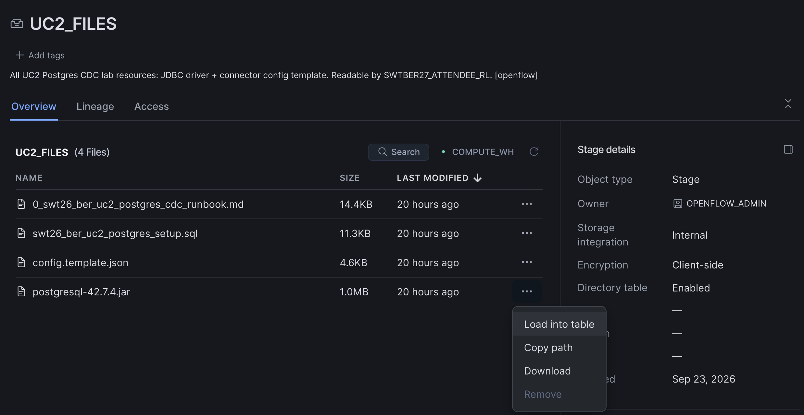

Keep the file handy - you'll upload it in step 4.3.

> Alternative: download the same driver from
> [Maven Central](https://repo1.maven.org/maven2/org/postgresql/postgresql/42.7.4/postgresql-42.7.4.jar).

#### 4.1 - Find the Gen 2 PostgreSQL connector

Open **Openflow** and go to the **Connector library** tab. Type `postgres` in
the search box.

You will see **two connectors, both called "PostgreSQL", both by Snowflake**.
They are not the same thing:

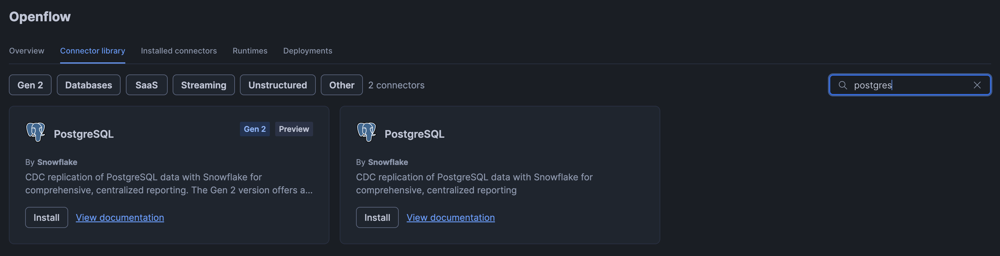

> **Pick the one badged `Gen 2`** (it is also badged `Preview`). Its description
> mentions "The Gen 2 version offers a...". The other card is the older
> generation connector and will **not** work with your Gen 2 runtime.
>
> Easiest way to avoid the mistake: click the **`Gen 2`** filter chip first, so
> only Gen 2 connectors are listed.

Click **`Install`** on the Gen 2 card. (The action is *Install*, not *Create*.)

#### 4.2 - Install it into your runtime

The **Install PostgreSQL** dialog opens:

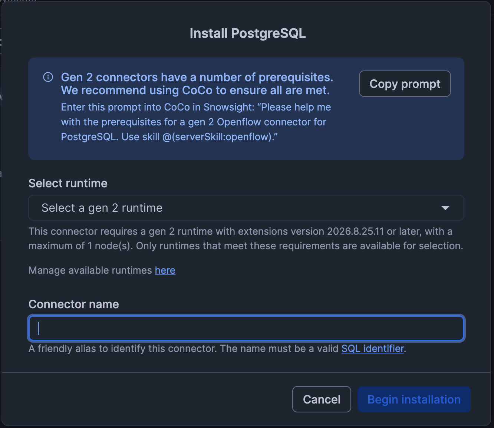

| Field | What to enter |
|---|---|
| **Select runtime** | your runtime, `SWTBER26_USER<N>_RUNTIME` |
| **Connector name** | `UC2_PG_CDC` (must be a valid SQL identifier) |

Then click **`Begin installation`**.

> The dialog only lists runtimes that qualify: a **Gen 2** runtime, extensions
> version `2026.8.25.11` or later, **maximum 1 node**. The runtime we created for
> you meets all three - if your dropdown is empty, ask a host.
>
> The blue box also offers a **`Copy prompt`** button that hands Snowflake's own
> `@(serverSkill:openflow)` skill a prerequisites prompt. You don't need it for
> this lab (everything is pre-provisioned), but it's a handy trick to remember.

Installation drops you into the configuration wizard, which has **seven steps**:
Source, Replication table schema, Replication columns, Destination details,
Tuning, Migration, Summary.

> **After filling in each step, click `Verify configuration` before clicking
> `Next`.** Every step has that button. It checks your input against the live
> Postgres and your Snowflake privileges, so a typo surfaces immediately instead
> of failing silently ten minutes later.

#### 4.3 - Step "Source"

Use the values from Step 3.

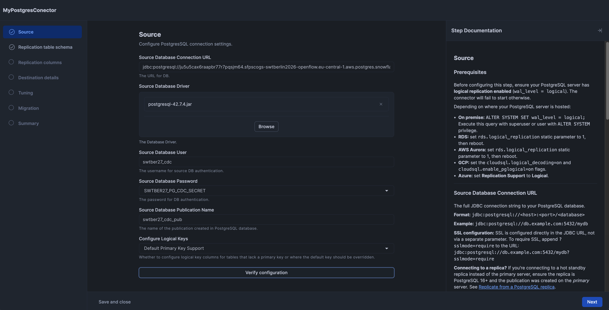

| Field | Value |
|---|---|
| Source Database Connection URL | the `JDBC_URL` from Step 3 |
| Source Database Driver | **Browse** and upload the `postgresql-42.7.4.jar` you downloaded in 4.0 |
| Source Database User | `swtber26_cdc` |
| Source Database Password | pick the secret **`SWTBER26_PG_CDC_SECRET`** from the dropdown |
| Source Database Publication Name | `swtber26_cdc_pub` |
| Configure Logical Keys | `Default Primary Key Support` |

Note the password is a **dropdown of Snowflake secrets**, not a text box - you
never see or paste the actual password.

Click **`Verify configuration`**, then **`Next`**.

#### 4.4 - Step "Replication table schema"

Leave **`Manual selection`** selected (the default).

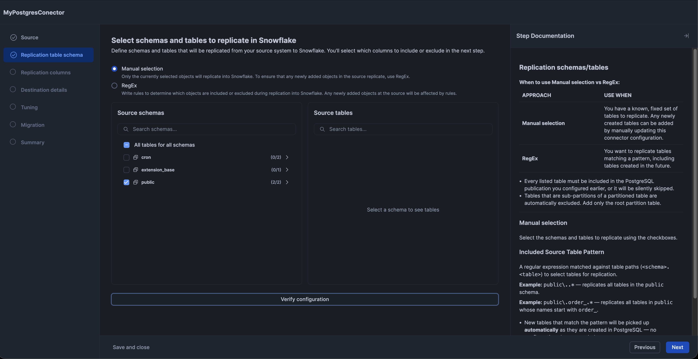

> **Tick `public` only.** Leave `cron` and `extension_base` unticked - those are
> Postgres extension internals, they're not in our publication, and selecting
> them will just produce noise.

Ticking `public` selects both of its tables (`sensors` and `sensor_readings`),
shown as `(2/2)`.

Click **`Verify configuration`**, then **`Next`**.

#### 4.5 - Step "Replication columns"

Nothing to change - we replicate all columns. Click **`Verify configuration`**,
then **`Next`**.

#### 4.6 - Step "Destination details"

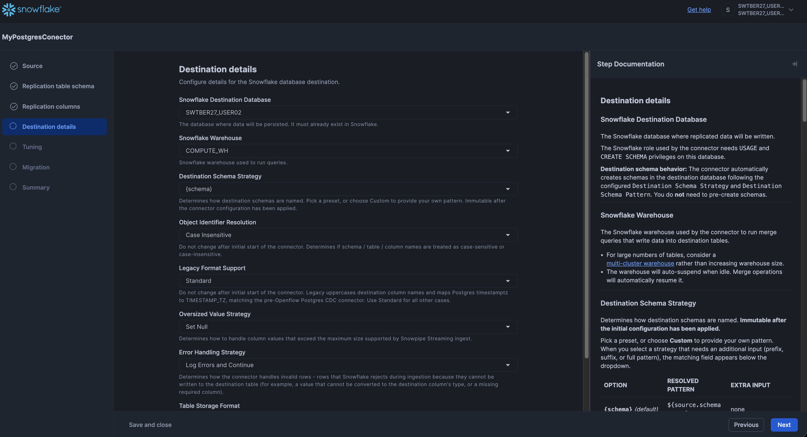

| Field | Value |
|---|---|
| Snowflake Destination Database | `SWTBER26_USER<N>` |
| Snowflake Warehouse | `COMPUTE_WH` |
| Destination Schema Strategy | `{schema}` |
| Object Identifier Resolution | `Case Insensitive` |
| Legacy Format Support | `Standard` |
| Oversized Value Strategy | `Set Null` |
| Error Handling Strategy | `Log Errors and Continue` |

Those are the defaults apart from the first two. You do **not** need to
pre-create the destination schema - the connector creates it for you, and with
`{schema}` the Postgres `public` schema lands in Snowflake as `PUBLIC`.

Click **`Verify configuration`**, then **`Next`**.

#### 4.7 - Step "Tuning"

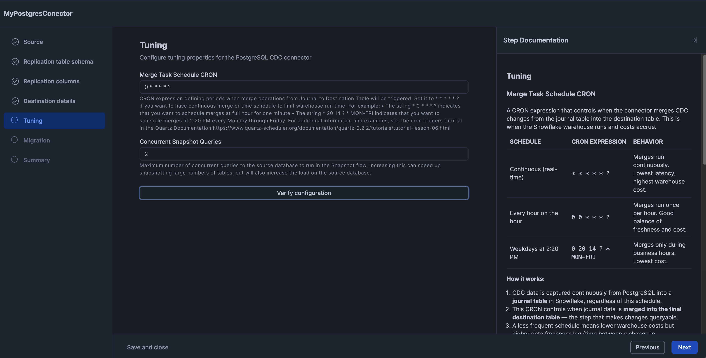

| Field | Value |
|---|---|
| Merge Task Schedule CRON | `0 * * * * ?` |
| Concurrent Snapshot Queries | `2` |

Both are defaults - keep them. CDC changes always stream into a **journal
table** immediately; this CRON controls how often the journal is merged into the
final destination table, which is what makes changes queryable. `0 * * * * ?`
means once a minute, so expect up to ~60s of lag in Step 5.

Click **`Verify configuration`**, then **`Next`**.

#### 4.8 - Step "Migration"

Nothing to change. Click **`Next`**.

#### 4.9 - Step "Summary" - review and apply

The Summary step shows **Review configuration** with everything you entered.

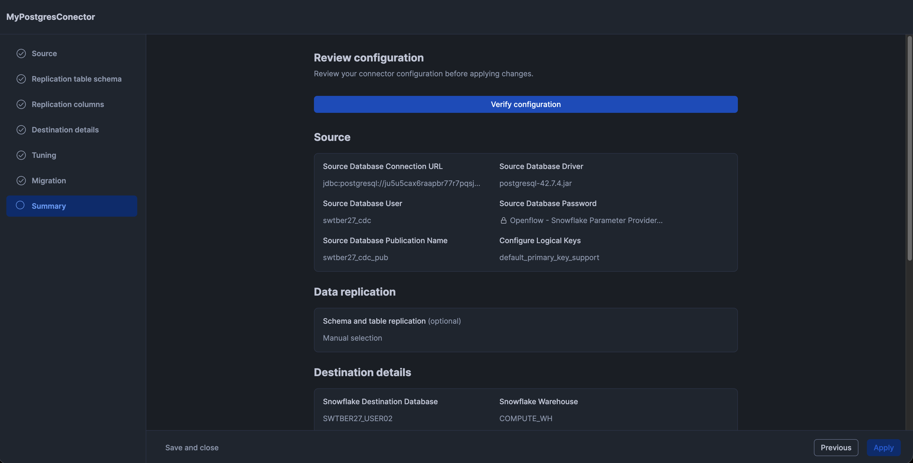

Click the blue **`Verify configuration`** button one last time. You'll get a
modal that checks every step in turn:

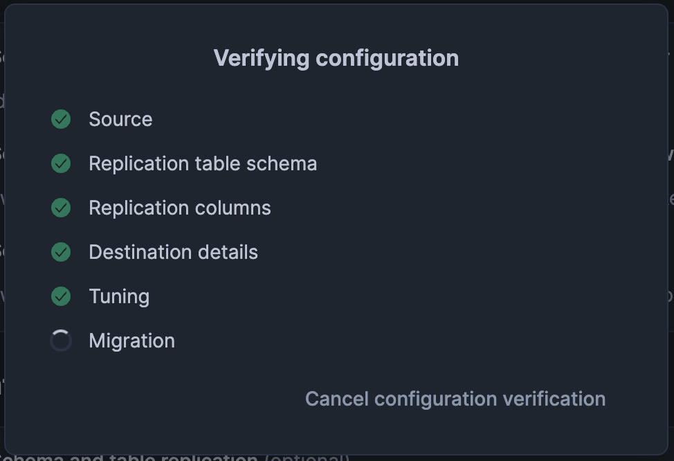

Wait for all steps to show a green tick. Then click **`Apply`**.

#### 4.10 - Start the connector

**Applying the configuration does not start the connector.** Go to the
**Installed connectors** tab - your connector is listed with state **`Stopped`**.

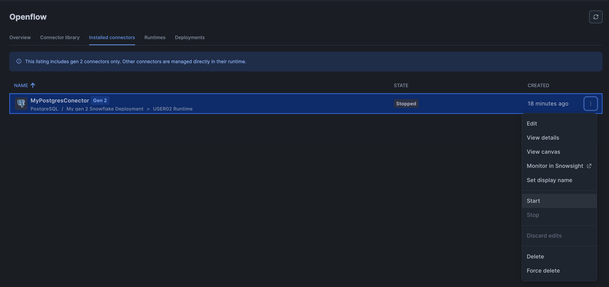

Open the row's **`⋮`** menu and choose **`Start`**.

> That menu is also where you'll find **View canvas** (the NiFi flow) and
> **Monitor in Snowsight** - both useful while you wait for data in Step 5.

Give it a minute, refresh, and confirm the state becomes running. Now jump to
Step 5 to watch the data arrive.

---

### Seeing what the wizard produced, as SQL

A Gen 2 connector is a real Snowflake object, and everything you just clicked
through was written to a `config.json` on the connector's own internal versioned
stage. It's worth looking at - it's exactly what Option B writes by hand, and
it's how you'd capture a hand-tuned connector for reuse or version control.

```sql
USE ROLE SWTBER26_USER<N>_RL;
USE WAREHOUSE COMPUTE_WH;

-- The connector object itself
SHOW OPENFLOW CONNECTORS IN SCHEMA SWTBER26_USER<N>.PUBLIC;

-- What's on its versioned stage
LS 'snow://openflow_connector/SWTBER26_USER<N>.PUBLIC.UC2_PG_CDC/versions/live/';
```

You'll see your `config.json` and the driver jar you uploaded. To read the JSON,
copy it into your own stage and select it as text:

```sql
CREATE STAGE IF NOT EXISTS SWTBER26_USER<N>.PUBLIC.MY_UC2_FILES;

CREATE OR REPLACE FILE FORMAT SWTBER26_USER<N>.PUBLIC.RAW_TEXT
  TYPE = CSV FIELD_DELIMITER = NONE FIELD_OPTIONALLY_ENCLOSED_BY = NONE
  ESCAPE_UNENCLOSED_FIELD = NONE COMPRESSION = NONE;

COPY FILES INTO @SWTBER26_USER<N>.PUBLIC.MY_UC2_FILES/
  FROM 'snow://openflow_connector/SWTBER26_USER<N>.PUBLIC.UC2_PG_CDC/versions/live/'
  FILES = ('config.json');

ALTER STAGE SWTBER26_USER<N>.PUBLIC.MY_UC2_FILES REFRESH;

-- Reassemble the file into a single JSON value
SELECT TRY_PARSE_JSON(LISTAGG($1, '\n')) AS config
FROM @SWTBER26_USER<N>.PUBLIC.MY_UC2_FILES/config.json
  (FILE_FORMAT => 'SWTBER26_USER<N>.PUBLIC.RAW_TEXT');
```

Compare that output with the config in Option B below - same structure, same
property names. The guided setup is a front end over this file.

### Option B - SQL (no local tools needed)

Gen2 connectors are Snowflake objects, so the whole setup can be scripted. The
configuration lives in a `config.json` on the connector's own internal versioned
stage - you don't pass parameters in the DDL.

You can do all of this **from a Snowsight worksheet**. You never edit JSON by
hand and you never need Snowflake CLI: a helper function generates your
`config.json`, and `COPY FILES` moves it onto the connector's stage.

**1. Create the connector**

```sql
USE ROLE SWTBER26_USER<N>_RL;
USE WAREHOUSE COMPUTE_WH;

CREATE OPENFLOW CONNECTOR SWTBER26_USER<N>.PUBLIC.UC2_PG_CDC
  IN RUNTIME SWTBER26_USER<N>.PUBLIC.SWTBER26_USER<N>_RUNTIME
  FROM DEFINITION OPENFLOW_POSTGRES_CDC
  DISPLAY_NAME = 'UC2 Postgres CDC';

-- Creation is asynchronous. Wait before touching its stage.
SELECT SYSTEM$WAIT_FOR_STABLE_OPENFLOW_CONNECTORS(600, 'SWTBER26_USER<N>.PUBLIC.UC2_PG_CDC');
```

**2. Generate your `config.json`**

`OPENFLOW_SHARED.PG.UC2_CONFIG_FOR(<your_database>)` returns a complete,
ready-to-use configuration - source URL, user, secret reference, publication,
table list, and your own destination database already filled in.

Have a look at it first if you're curious:

```sql
SELECT OPENFLOW_SHARED.PG.UC2_CONFIG_FOR('SWTBER26_USER<N>');
```

Then write it to a stage in your own database:

```sql
CREATE STAGE IF NOT EXISTS SWTBER26_USER<N>.PUBLIC.MY_UC2_FILES;

COPY INTO @SWTBER26_USER<N>.PUBLIC.MY_UC2_FILES/config.json
  FROM (SELECT OPENFLOW_SHARED.PG.UC2_CONFIG_FOR('SWTBER26_USER<N>'))
  FILE_FORMAT = (TYPE = CSV COMPRESSION = NONE FIELD_DELIMITER = NONE
                 FIELD_OPTIONALLY_ENCLOSED_BY = NONE ESCAPE_UNENCLOSED_FIELD = NONE)
  OVERWRITE = TRUE SINGLE = TRUE HEADER = FALSE;
```

> The `FILE_FORMAT` options matter: they stop Snowflake adding quotes or escapes
> that would corrupt the JSON.

**3. Copy the config and the JDBC driver onto the connector's stage**

The connector does not ship with the PostgreSQL JDBC driver - you supply it as a
connector *asset*. A copy is staged for you in `OPENFLOW_SHARED`:

```sql
LS @OPENFLOW_SHARED.PG.UC2_FILES;   -- postgresql-42.7.4.jar, config.template.json, ...
```

```sql
-- your generated config
COPY FILES INTO 'snow://openflow_connector/SWTBER26_USER<N>.PUBLIC.UC2_PG_CDC/versions/live/'
  FROM @SWTBER26_USER<N>.PUBLIC.MY_UC2_FILES/ FILES = ('config.json');

-- the shared JDBC driver
COPY FILES INTO 'snow://openflow_connector/SWTBER26_USER<N>.PUBLIC.UC2_PG_CDC/versions/live/'
  FROM @OPENFLOW_SHARED.PG.UC2_FILES/ FILES = ('postgresql-42.7.4.jar');

-- expect exactly two files: config.json and postgresql-42.7.4.jar
LS 'snow://openflow_connector/SWTBER26_USER<N>.PUBLIC.UC2_PG_CDC/versions/live/';
```

**4. Commit and start**

```sql
ALTER OPENFLOW CONNECTOR SWTBER26_USER<N>.PUBLIC.UC2_PG_CDC COMMIT;
SELECT SYSTEM$WAIT_FOR_STABLE_OPENFLOW_CONNECTORS(700, 'SWTBER26_USER<N>.PUBLIC.UC2_PG_CDC');

ALTER OPENFLOW CONNECTOR SWTBER26_USER<N>.PUBLIC.UC2_PG_CDC START;
SELECT SYSTEM$WAIT_FOR_OPENFLOW_CONNECTOR_STATUS(700, 'RUNNING', 'SWTBER26_USER<N>.PUBLIC.UC2_PG_CDC');
```

That's it - skip to Step 5 to verify.

> **Changing the config later.** `COMMIT` consumes the live version, so a further
> `COPY FILES` fails with *"Live version is not found."* Reopen a writable copy
> first, then repeat steps 2-4:
>
> ```sql
> ALTER OPENFLOW CONNECTOR SWTBER26_USER<N>.PUBLIC.UC2_PG_CDC ADD LIVE VERSION FROM LAST;
> ```

<details>
<summary>Doing it with Snowflake CLI instead (optional)</summary>

If you prefer to edit the JSON yourself, download the template, edit it, and
upload it with `PUT`. This needs a local client - **Snowsight cannot `GET`/`PUT`
on a connector's versioned stage**.

```sql
GET @OPENFLOW_SHARED.PG.UC2_FILES/config.template.json file:///tmp/uc2/;
-- replace __PG_HOST__, __DRIVER_JAR__ and __DEST_DB__, save as config.json

PUT 'file:///tmp/uc2/config.json'
    'snow://openflow_connector/SWTBER26_USER<N>.PUBLIC.UC2_PG_CDC/versions/live/'
    AUTO_COMPRESS = FALSE OVERWRITE = TRUE;
```

Two `PUT` traps: the destination must be the **directory**, ending in
`/versions/live/` - `PUT` appends the source filename itself, so writing
`.../versions/live/config.json` creates a nested `config.json/config.json` that
silently shadows the real file. And your local file must literally be named
`config.json`.

</details>

---

## Step 5 - Verify

The connector does an initial **snapshot** of both tables, then switches to
**incremental** CDC. The snapshot takes a minute or two.

```sql
USE ROLE SWTBER26_USER<N>_RL;
USE WAREHOUSE COMPUTE_WH;

SHOW OPENFLOW CONNECTORS IN DATABASE SWTBER26_USER<N>;   -- expect status RUNNING

-- The connector creates the schema and tables for you.
SELECT COUNT(*) FROM SWTBER26_USER<N>.PUBLIC.SENSORS;           -- expect 10
SELECT COUNT(*) FROM SWTBER26_USER<N>.PUBLIC.SENSOR_READINGS;   -- ~20,000 and climbing
```

In the Snowsight object explorer, your destination database now has a `PUBLIC`
schema with **three** tables:

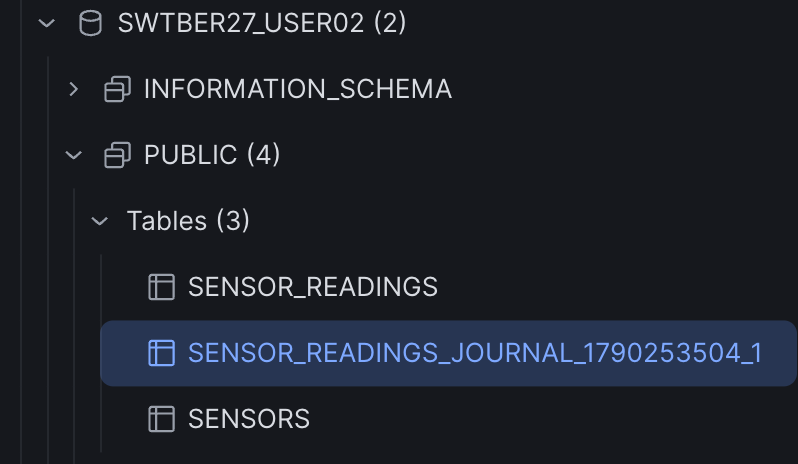

| Table | What it is |
|---|---|
| `SENSORS` | replica of `public.sensors` |
| `SENSOR_READINGS` | replica of `public.sensor_readings` - query this one |
| `SENSOR_READINGS_JOURNAL_...` | the CDC journal (raw change events) |

The journal table is connector plumbing: changes land there continuously, then
the merge task you configured in the Tuning step (`0 * * * * ?`, once a minute)
applies them to `SENSOR_READINGS`. That's why new rows can take up to a minute to
show up below - it isn't a broken pipeline, it's the merge schedule.

Now prove the stream is live - run this twice, about a minute apart. The count
should grow by roughly 60 (5 rows every 5 seconds):

```sql
SELECT COUNT(*) AS readings, MAX(READING_TS) AS newest
FROM SWTBER26_USER<N>.PUBLIC.SENSOR_READINGS;
```

And a query that actually uses the join, to show both tables replicated:

```sql
SELECT s.LOCATION,
       s.SENSOR_TYPE,
       COUNT(*)                        AS readings,
       ROUND(AVG(r.VALUE), 2)          AS avg_value,
       MAX(r.READING_TS)               AS newest
FROM SWTBER26_USER<N>.PUBLIC.SENSOR_READINGS r
JOIN SWTBER26_USER<N>.PUBLIC.SENSORS s
  ON s.SENSOR_ID = r.SENSOR_ID
GROUP BY s.LOCATION, s.SENSOR_TYPE
ORDER BY s.LOCATION, s.SENSOR_TYPE;
```

Runtime and connector telemetry lands in the shared event table, which you can
read automatically:

```sql
SELECT TIMESTAMP,
       TRY_PARSE_JSON(VALUE::string):formattedMessage::string AS msg
FROM OPENFLOW_SHARED.INFRA.OPENFLOW_EVENTS
WHERE TIMESTAMP > DATEADD('minute', -15, CURRENT_TIMESTAMP())
ORDER BY TIMESTAMP DESC
LIMIT 50;
```

## Step 6 - Bonus: watch an UPDATE and a DELETE replicate

CDC isn't just inserts. `sensor_readings` has a primary key, so updates and
deletes replicate too. Ask your instructor to run something like this on the
Postgres side:

```sql
UPDATE public.sensors SET location = 'Building-Z' WHERE sensor_id = 1;
```

Then, within a minute:

```sql
SELECT SENSOR_ID, SENSOR_NAME, LOCATION
FROM SWTBER26_USER<N>.PUBLIC.SENSORS
ORDER BY SENSOR_ID;
```

> **Why the primary key matters**: without a primary key, a unique index, or
> `REPLICA IDENTITY FULL`, a Postgres table is replicated **insert-only** -
> updates and deletes are silently skipped.

---

## Troubleshooting

**`SHOW OPENFLOW CONNECTORS` says `START_FAILED` or `UPDATE_FAILED`.**
That status alone tells you nothing. The real error is in the event table:

```sql
SELECT TIMESTAMP,
       TRY_PARSE_JSON(VALUE::string):formattedMessage::string AS msg
FROM OPENFLOW_SHARED.INFRA.OPENFLOW_EVENTS
WHERE TIMESTAMP > DATEADD('minute', -15, CURRENT_TIMESTAMP())
  AND TRY_PARSE_JSON(VALUE::string):level::string = 'ERROR'
ORDER BY TIMESTAMP DESC
LIMIT 20;
```

Use `TRY_PARSE_JSON`, not `PARSE_JSON` - some rows aren't valid JSON and will
error the whole query out.

**`'Snowflake Warehouse' validated against 'COMPUTE_WH' is invalid because
Value is not one of the allowable values`.**
Misleading message: the value is fine, the *grant* is missing. The warehouse is
validated as your runtime's execute-as role. Make sure your role has
`USAGE, OPERATE` on `COMPUTE_WH` - it should via `SWTBER26_ATTENDEE_RL`.

**`'Database Driver Locations' ... No resources were specified`** or
**`'Source Database Driver' is required`.**
The JDBC driver jar isn't attached. See the driver note in Step 4.

**`'Legacy Format Support' is invalid because Legacy Format Support is
required`.**
Your `config.json` predates a connector update. Set
`"Legacy Format Support": {"valueType": "STRING_LITERAL", "value": "STANDARD"}`
in the **Destination details** group, or regenerate the config from a freshly
created connector.

**`PSQLException: The connection attempt failed.`**
Network path problem, not credentials. Two things must both be true: your
runtime needs the `SWTBER26_LAB_EAI` external access integration attached
(egress), and the Postgres instance's network policy must allow the runtime's
egress IP range (ingress). Check the EAI first:

```sql
SHOW OPENFLOW RUNTIMES IN DATABASE SWTBER26_USER<N>;   -- external_access_integrations column
```

If it's missing, attach it:

```sql
ALTER OPENFLOW RUNTIME SWTBER26_USER<N>.PUBLIC.SWTBER26_USER<N>_RUNTIME
  ADD EXTERNAL_ACCESS_INTEGRATIONS = (SWTBER26_LAB_EAI);
```

No restart needed. If the EAI is present and it still fails, tell the lab admin -
the ingress allowlist on the Postgres instance probably needs updating.

**A table I selected isn't replicating, with no error.**
Only tables in the publication are replicated, and a table missing from it is
skipped **silently**. Stick to `public.sensors` and `public.sensor_readings`.

**Row counts stopped growing.**
Check the connector is still `RUNNING`, then check the generator is still
running on the Postgres side (ask the lab admin). The snapshot phase also
finishes before incremental starts, so a brief plateau right after startup is
normal.

**`ALTER ... START` says the connector is in `UPDATING` status.**
Configuration changes are asynchronous. Wait first:

```sql
SELECT SYSTEM$WAIT_FOR_STABLE_OPENFLOW_CONNECTORS(600, 'SWTBER26_USER<N>.PUBLIC.UC2_PG_CDC');
```

**Login into the Openflow canvas fails / blank screen.**
Make sure your *active* role is `SWTBER26_USER<N>_RL`, not `ACCOUNTADMIN` or any
admin role - Openflow runtimes reject `ACCOUNTADMIN` as the active role.

---

## Files - for Admin setup

| File | What it is | Who runs it |
|---|---|---|
| `config.template.json` | Connector `config.json` with 3 placeholders (`__PG_HOST__`, `__DRIVER_JAR__`, `__DEST_DB__`) | Attendees (Option B) |
| `swt26_ber_uc2_postgres_setup.sql` | Source-side setup: tables, seed data, CDC user, publication, generator | Lab admin, once, via `psql` |
| `screenshots/` | Wizard screenshots referenced in the guide | - |

## Things worth knowing

- **The connector does not ship with the PostgreSQL JDBC driver.** You supply it
  as a connector *asset*, staged at
  `@OPENFLOW_SHARED.PG.UC2_FILES/postgresql-42.7.4.jar`.
- **The connector requires a single-node runtime** (`MIN_NODES = MAX_NODES = 1`).
  Scale by adding runtimes, not nodes.
- **Only tables in the publication replicate.** A table missing from it is
  skipped silently, with no error.
- **Primary keys decide whether UPDATE/DELETE replicate.** Without a primary
  key, unique index, or `REPLICA IDENTITY FULL`, a table is insert-only.
- **Dropping a connector does not drop its replication slot.** Orphaned slots
  pin WAL forever. See section 8 of `swt26_ber_uc2_postgres_setup.sql` for
  cleanup. A slot is only released after a full
  `STOP` -> `TERMINATE` -> `DROP`; `TERMINATE FORCE` alone is not enough.
- **Real errors only appear in the event table**, not in
  `SHOW OPENFLOW CONNECTORS`. Query it with `TRY_PARSE_JSON`, not `PARSE_JSON`.
- **After any `PUT` to a lab stage, run `ALTER STAGE ... REFRESH`**, or the
  Snowsight stage browser shows it as empty.
- **Connector definitions evolve.** If a start fails with
  *'<Property>' is required*, regenerate the config from a freshly created
  connector and update `UC2_CONFIG_JSON` in `admin_setup.sql`.

## Admin setup order

1. `../0_setup/admin_setup.sql` - shared layer, Postgres instance, EAI, secret
2. `swt26_ber_uc2_postgres_setup.sql` - source tables, CDC user, publication, generator (via `psql`)
3. `../0_setup/rendered/provision_users.sql` - attendee databases, roles, users
4. `../0_setup/rendered/provision_runtimes.sql` - one runtime per attendee
